# Claude Code

[根目录](./) > **Claude Code**

## 项目愿景

Claude Code 是一个终端 AI 编程助手，通过自然语言命令帮助开发者更快地编码，能够理解代码库、执行例行任务、解释复杂代码和处理 Git 工作流。本项目包含 Claude Code 的官方插件集合和示例代码，展示了插件系统的强大功能和扩展性。

## 架构总览

```mermaid
graph TD
    A["(根) Claude Code"] --> B["plugins"];
    A --> C["scripts"];
    A --> D["examples"];

    B --> E["agent-sdk-dev"];
    B --> F["code-review"];
    B --> G["commit-commands"];
    B --> H["explanatory-output-style"];
    B --> I["feature-dev"];
    B --> J["frontend-design"];
    B --> K["learning-output-style"];
    B --> L["pr-review-toolkit"];
    B --> M["security-guidance"];

    C --> N["auto-close-duplicates.ts"];
    C --> O["backfill-duplicate-comments.ts"];

    D --> P["hooks"];

    click E "./plugins/agent-sdk-dev/CLAUDE.md" "查看 agent-sdk-dev 模块文档"
    click F "./plugins/code-review/CLAUDE.md" "查看 code-review 模块文档"
    click G "./plugins/commit-commands/CLAUDE.md" "查看 commit-commands 模块文档"
    click H "./plugins/explanatory-output-style/CLAUDE.md" "查看 explanatory-output-style 模块文档"
    click I "./plugins/feature-dev/CLAUDE.md" "查看 feature-dev 模块文档"
    click J "./plugins/frontend-design/CLAUDE.md" "查看 frontend-design 模块文档"
    click K "./plugins/learning-output-style/CLAUDE.md" "查看 learning-output-style 模块文档"
    click L "./plugins/pr-review-toolkit/CLAUDE.md" "查看 pr-review-toolkit 模块文档"
    click M "./plugins/security-guidance/CLAUDE.md" "查看 security-guidance 模块文档"
    click N "./scripts/CLAUDE.md" "查看 scripts 模块文档"
    click P "./examples/CLAUDE.md" "查看 examples 模块文档"
```



## 模块索引

| 模块路径 | 语言 | 主要功能 | 状态 |
|---------|------|----------|------|
| [plugins/agent-sdk-dev](./plugins/agent-sdk-dev/) | Markdown | Claude Agent SDK 开发工具 | ✅ 完整 |
| [plugins/code-review](./plugins/code-review/) | Markdown | 自动化 PR 代码审查 | ✅ 完整 |
| [plugins/commit-commands](./plugins/commit-commands/) | Markdown | Git 工作流自动化 | ✅ 完整 |
| [plugins/explanatory-output-style](./plugins/explanatory-output-style/) | Shell/JSON | 详细解释性输出风格 | ✅ 完整 |
| [plugins/feature-dev](./plugins/feature-dev/) | Markdown | 功能开发工作流 | ✅ 完整 |
| [plugins/frontend-design](./plugins/frontend-design/) | Markdown/Skill | 前端设计技能 | ✅ 完整 |
| [plugins/learning-output-style](./plugins/learning-output-style/) | Shell/JSON | 学习导向输出风格 | ✅ 完整 |
| [plugins/pr-review-toolkit](./plugins/pr-review-toolkit/) | Markdown | PR 审查工具包 | ✅ 完整 |
| [plugins/security-guidance](./plugins/security-guidance/) | Python | 安全提醒钩子 | ✅ 完整 |
| [scripts/](./scripts/) | TypeScript | GitHub 自动化脚本 | ✅ 完整 |
| [examples/](./examples/) | Python | 钩子示例代码 | ✅ 完整 |

## 运行与开发

### 环境要求
- Node.js 18+ （用于运行 TypeScript 脚本）
- Python 3+ （用于钩子和示例）
- Bash 支持 （用于 shell 钩子）

### 开发工作流
1. **插件开发**：在 `plugins/` 目录下创建新插件，遵循标准插件结构
2. **钩子开发**：参考 `examples/hooks/` 中的示例实现自定义钩子
3. **脚本维护**：使用 `scripts/` 目录下的 TypeScript 脚本进行 GitHub 自动化

### 插件安装
```bash
# 在项目中使用插件
claude
/plugin install <plugin-name>
```

## 测试策略

- **插件测试**：每个插件包含 README.md 和使用示例
- **钩子测试**：通过 `examples/hooks/` 提供可运行的验证示例
- **脚本测试**：TypeScript 脚本包含调试输出和错误处理
- **集成测试**：通过实际使用场景验证插件和钩子功能

## 编码规范

- **插件结构**：遵循 `.claude-plugin/plugin.json` 元数据标准
- **文档优先**：每个模块必须有完整的 README.md 文档
- **钩子设计**：使用 JSON 格式输入/输出，支持会话状态管理
- **安全考虑**：所有用户输入都需要验证和清理

## AI 使用指引

### 插件开发模式
1. **理解需求**：明确插件要解决的具体问题
2. **设计架构**：选择命令、代理或钩子的最佳组合
3. **实现核心**：优先实现主要功能，再添加辅助特性
4. **测试验证**：使用多种场景验证插件的鲁棒性

### 代码审查要点
- 插件元数据完整性
- 错误处理和边界情况
- 文档清晰度和准确性
- 安全性和输入验证

## 变更记录 (Changelog)

### 2025-11-18 16:43:03 - 初始化架构师分析
- 完成全仓库扫描和模块识别
- 生成根级和模块级 CLAUDE.md 文档
- 创建 Mermaid 结构图和导航面包屑
- 统计覆盖率：47 个文件，11 个模块，100% 覆盖

---

## 覆盖率报告

**扫描统计**：
- 总文件数：47
- 已扫描文件数：47
- 覆盖率：100%
- 主要语言：Markdown (37), TypeScript (2), Python (2), Shell (2), JSON (3)

**模块覆盖状态**：
- ✅ plugins/ - 9 个插件模块，完整扫描
- ✅ scripts/ - 2 个 TypeScript 脚本，完整扫描
- ✅ examples/ - 1 个示例模块，完整扫描

**未覆盖缺口**：无

**推荐的下一步**：仓库已完成完整扫描，所有模块都有详细文档。可以开始进行具体的开发工作或插件扩展。